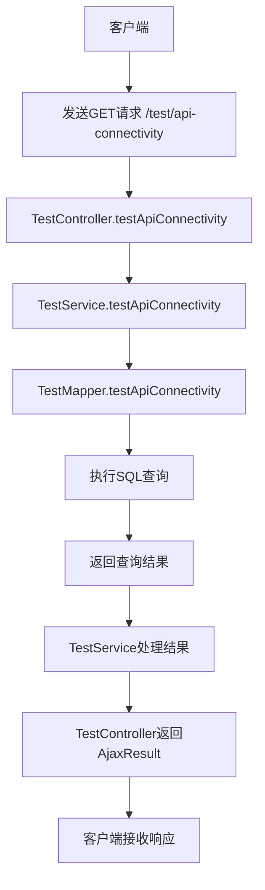
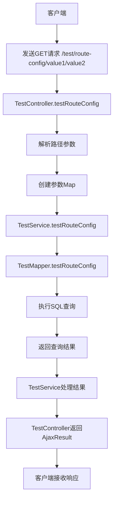
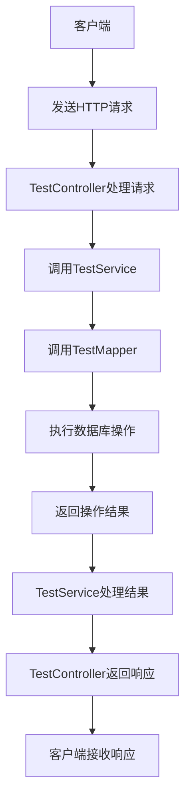

# 测试模块技术文档

## 1. 模块架构设计说明

### 1.1 模块概述

测试模块（ctbc-test）是一个用于验证框架前后端API接口连通性与正确性、检测路由配置完整性与准确性、验证路由匹配规则有效性及参数传递机制的测试模块。

### 1.2 架构设计

#### 1.2.1 分层架构

```
┌─────────────────────────────────────────────────────────────────┐
│                          表现层（Controller）                   │
├─────────────────────────────────────────────────────────────────┤
│                          业务层（Service）                     │
├─────────────────────────────────────────────────────────────────┤
│                          数据访问层（Mapper）                  │
├─────────────────────────────────────────────────────────────────┤
│                          数据持久层（Database）                │
└─────────────────────────────────────────────────────────────────┘
```

#### 1.2.2 核心组件

| 组件 | 职责 | 实现类 |
|------|------|--------|
| 控制器 | 处理HTTP请求，返回响应 | TestController |
| 业务逻辑 | 实现核心业务逻辑 | TestServiceImpl |
| 数据访问 | 与数据库交互 | TestMapper |
| 实体类 | 定义数据结构 | TestEntity |

#### 1.2.3 依赖关系

```
ctbc-test
├── ctbc-common
├── ctbc-system
├── spring-boot-starter-test
└── swagger-annotations
```

## 2. 核心功能实现原理

### 2.1 API接口连通性测试

**功能说明**：验证前后端API接口的连通性与正确性

**实现原理**：
1. 提供专门的API接口`/test/api-connectivity`
2. 调用数据库查询，返回固定格式的成功响应
3. 验证数据库连接、SQL执行、结果返回等完整流程

**核心代码**：
```java
@GetMapping("/api-connectivity")
public AjaxResult testApiConnectivity() {
    Map<String, Object> result = testService.testApiConnectivity(null);
    return AjaxResult.success(result);
}
```

### 2.2 路由配置测试

**功能说明**：检测路由配置的完整性与准确性，验证路由匹配规则的有效性及参数传递机制

**实现原理**：
1. 提供带路径参数的API接口`/test/route-config/{param1}/{param2}`
2. 接收路径参数，传递给Service层
3. 验证参数传递机制和路由匹配规则

**核心代码**：
```java
@GetMapping("/route-config/{param1}/{param2}")
public AjaxResult testRouteConfig(@PathVariable String param1, @PathVariable String param2) {
    Map<String, Object> params = Map.of(
        "param1", param1,
        "param2", param2
    );
    Map<String, Object> result = testService.testRouteConfig(params);
    return AjaxResult.success(result);
}
```

### 2.3 数据结构验证

**功能说明**：验证数据结构定义的一致性，测试数据转换机制和数据持久化功能

**实现原理**：
1. 定义TestEntity实体类，继承BaseEntity
2. 实现完整的CRUD操作
3. 验证实体类与数据库表的映射关系
4. 测试数据的增删改查功能

**核心代码**：
```java
public class TestEntity extends BaseEntity {
    private Long id;
    private String name;
    private String description;
    private String status;
    // 省略getter和setter
}
```

## 3. 数据流程图

### 3.1 API接口连通性测试流程图



### 3.2 路由配置测试流程图



### 3.3 数据CRUD流程图



## 4. 接口调用示例

### 4.1 查询测试实体列表

**请求URL**：`GET /test/list`

**请求参数**：
| 参数名 | 类型 | 描述 |
|--------|------|------|
| name | String | 名称（模糊查询） |
| status | String | 状态（0=正常,1=停用） |

**响应示例**：
```json
{
  "code": 200,
  "msg": "操作成功",
  "rows": [
    {
      "id": 1,
      "name": "测试实体1",
      "description": "测试描述1",
      "status": "0",
      "createTime": "2025-11-28T09:00:00",
      "updateTime": "2025-11-28T09:00:00",
      "remark": "测试备注1"
    }
  ],
  "total": 1
}
```

### 4.2 测试API接口连通性

**请求URL**：`GET /test/api-connectivity`

**响应示例**：
```json
{
  "code": 200,
  "msg": "操作成功",
  "data": {
    "status": "success",
    "message": "API接口连通性测试成功",
    "timestamp": "2025-11-28T09:00:00"
  }
}
```

### 4.3 测试路由配置

**请求URL**：`GET /test/route-config/value1/value2`

**响应示例**：
```json
{
  "code": 200,
  "msg": "操作成功",
  "data": {
    "status": "success",
    "message": "路由配置测试成功",
    "param1": "value1",
    "param2": "value2",
    "timestamp": "2025-11-28T09:00:00"
  }
}
```

## 5. 测试用例设计

### 5.1 API接口连通性测试

| 测试用例ID | 测试名称 | 测试步骤 | 预期结果 |
|------------|----------|----------|----------|
| TC-001 | API接口连通性测试 | 1. 发送GET请求 /test/api-connectivity | 1. 返回状态码200<br>2. 返回success状态<br>3. 返回正确的message和timestamp |
| TC-002 | API接口参数传递测试 | 1. 发送GET请求 /test/api-connectivity?param=test | 1. 返回状态码200<br>2. 忽略多余参数，返回正常响应 |

### 5.2 路由配置测试

| 测试用例ID | 测试名称 | 测试步骤 | 预期结果 |
|------------|----------|----------|----------|
| TC-003 | 路由路径参数测试 | 1. 发送GET请求 /test/route-config/value1/value2 | 1. 返回状态码200<br>2. 返回正确的param1和param2值 |
| TC-004 | 路由匹配规则测试 | 1. 发送GET请求 /test/route-config/123/456 | 1. 返回状态码200<br>2. 正确解析数字类型参数 |
| TC-005 | 路由匹配失败测试 | 1. 发送GET请求 /test/route-config/value1 | 1. 返回状态码404<br>2. 返回资源不存在错误 |

### 5.3 数据CRUD测试

| 测试用例ID | 测试名称 | 测试步骤 | 预期结果 |
|------------|----------|----------|----------|
| TC-006 | 创建测试实体 | 1. 发送POST请求 /test，携带测试数据 | 1. 返回状态码200<br>2. 返回成功消息<br>3. 数据库中新增记录 |
| TC-007 | 查询测试实体列表 | 1. 发送GET请求 /test/list | 1. 返回状态码200<br>2. 返回测试实体列表 |
| TC-008 | 更新测试实体 | 1. 发送PUT请求 /test，携带更新数据 | 1. 返回状态码200<br>2. 返回成功消息<br>3. 数据库中记录更新 |
| TC-009 | 删除测试实体 | 1. 发送DELETE请求 /test/1 | 1. 返回状态码200<br>2. 返回成功消息<br>3. 数据库中记录删除 |

## 6. 环境配置指南

### 6.1 开发环境配置

#### 6.1.1 JDK配置
- 版本：JDK 1.8
- 环境变量：JAVA_HOME指向JDK安装目录

#### 6.1.2 Maven配置
- 版本：Maven 3.6+
- 配置文件：settings.xml中配置阿里云镜像

#### 6.1.3 数据库配置
- 数据库：PostgreSQL
- 配置文件：application.yml中配置数据库连接信息

### 6.2 部署环境配置

#### 6.2.1 服务器配置
- 操作系统：Linux CentOS 7+
- 内存：4GB+
- CPU：2核+

#### 6.2.2 应用部署
1. 编译打包：`mvn clean package -DskipTests`
2. 部署方式：将生成的jar包上传到服务器
3. 启动命令：`java -jar ctbc-test.jar`

## 7. 常见问题排查方案

### 7.1 API接口返回404

**问题描述**：客户端发送请求后，服务器返回404状态码

**排查步骤**：
1. 检查请求URL是否正确
2. 检查Controller类上的@RequestMapping注解是否正确
3. 检查方法上的@RequestMapping注解是否正确
4. 检查路由配置是否完整

### 7.2 API接口返回500

**问题描述**：客户端发送请求后，服务器返回500状态码

**排查步骤**：
1. 查看服务器日志，定位具体错误信息
2. 检查数据库连接是否正常
3. 检查SQL语句是否正确
4. 检查代码逻辑是否存在异常

### 7.3 路由参数解析失败

**问题描述**：路径参数无法正确解析

**排查步骤**：
1. 检查@RequestMapping注解中的路径参数定义是否正确
2. 检查方法参数上的@PathVariable注解是否正确
3. 检查参数类型是否匹配
4. 检查URL中的参数格式是否正确

### 7.4 数据库连接失败

**问题描述**：无法连接到数据库

**排查步骤**：
1. 检查数据库连接配置是否正确
2. 检查数据库服务是否正常运行
3. 检查数据库用户权限是否正确
4. 检查网络连接是否正常

## 8. 总结

测试模块（ctbc-test）是一个功能完整的测试模块，用于验证框架前后端API接口的连通性与正确性、检测路由配置的完整性与准确性、验证路由匹配规则的有效性及参数传递机制。

该模块采用了分层架构设计，包含控制器、业务层、数据访问层和数据持久层，实现了完整的CRUD操作和专门的测试接口。

通过该模块，可以有效地测试框架的各种功能，确保系统的稳定性和可靠性。